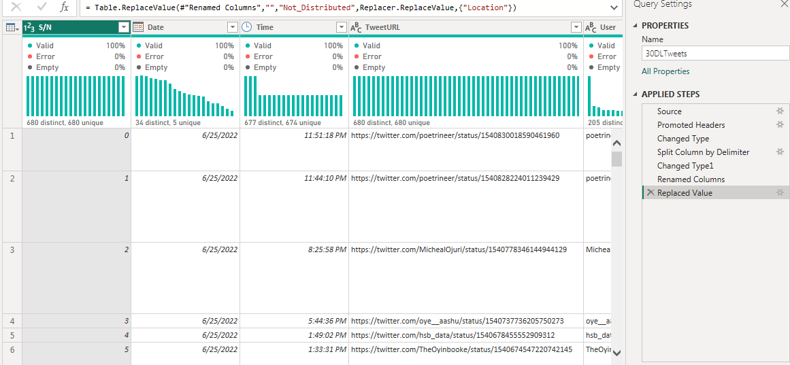
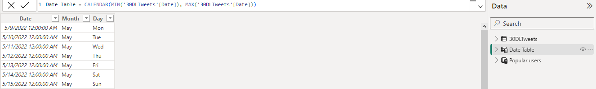
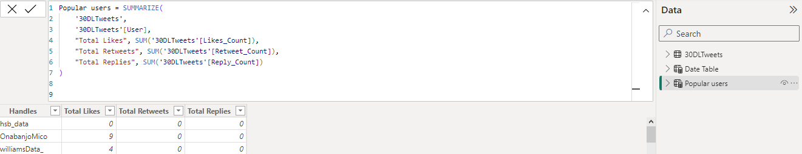
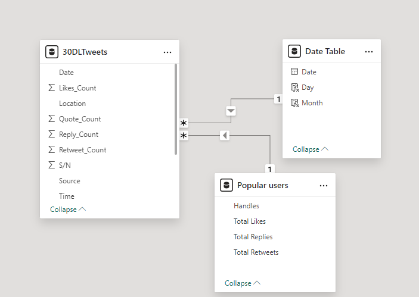
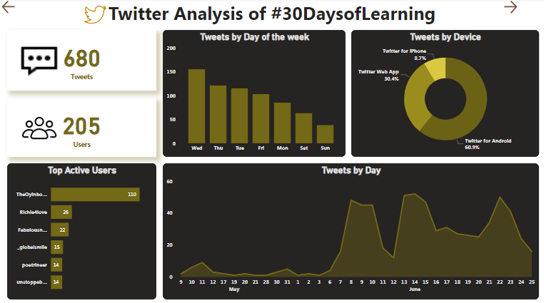
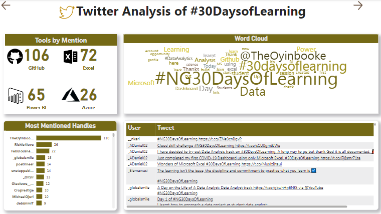
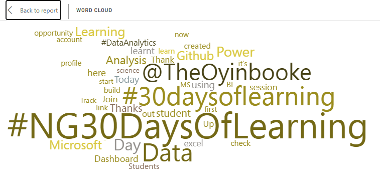
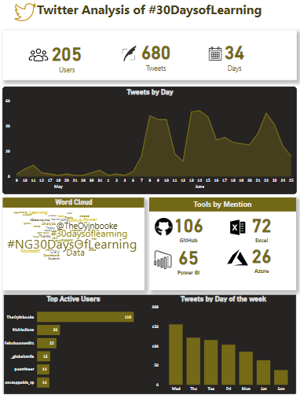

# Twitter 30 Days Learning Analysis

## Introduction
The purpose of this project is to demonstrate the power of storytelling through knowledge rendering analysis and visualization.
This analysis unveils hidden insights surrounding the 30 days learning activity that took place on twitter platform.

### The report consists of 4 pages
1. Welcome page
2. Summary
3. Details
4. dashboard

You can interact with the report [here](https://app.powerbi.com/groups/me/reports/3cbe3a9e-4547-4408-9882-8734c1154848/ReportSection?experience=power-bi)

## Skills Demonstrated
1. Data Cleaning and Transformation
2. Quick Measures
3. Relationship Modeling
4. Data Visualization
5. Filters and Tooltips
6. Page Navigation

## Problem Statement
This project is set to analyze and visualize tweets, top handles, devices, tools, and word clouds to uncover patterns in each of these categories.

## Data Sourcing
Scraped data was extracted from Github and imported into Power Query Editor for cleaning and transformation

## Data Cleaning & Transformation
Power Bi Power Query Editor was used for cleaning and transformation. There were no blanks and errors, however, I transformed the date column using split by delimiter. I renamed the added column and changed type to reflect data accurately.

### Cleaned Data

Data was loaded into power Bi and two extra tables were created as "Date table" and "Popular users."

### Additional Tables
Data table                                    |                                Popular Users
:---------------------------------------------|--------------------------------------------:
                         |               

A many to one relationship was established between the tables trough modeling process.

### Modeled Data

## Tweet Summary Analysis

1. Within the first two months of the 30 days learning exercise on Twitter, the community has generated 680 tweets from 205 unique contributors, showcasing a remarkable level of engagement and enthusiasm for knowledge shairng.
2. **"Oyinbooke"** emerged as the most prolific contributor consistently engaging with hashtags and fueling discussion with valuable insights.
3. Users engage more on weekdays, with Wednesday bein the most active day, while activity shows down significantly on weekends, indicating a clear preference for weekday learning and interaction.
4. 60.9% of users interacting with the hashtag are using Android devices while.
5. 30.4% interact through Web App
6. 8.7% of users tweet with iphone.
7. June saw a notable surge in Twitter activity with sinificant increase in the number of tweets compared to the previous month of May, indicating  growing momentum and engagement in conversations.

## Content Details Analysis

1. **Github** emerged as the most frequently mentioned tool in the conversations.
2. **Azure** is the least mentioned, revealing a clear preference for Github among the community during the initial two-month period of the program.
3. As shown in the Word Cloud, the top three most reoccuring hashtags are,
* #NG30DAYSOFLEARNING with 385 mentions
* #30DAYSOFLEARNING with 267 mentions
* @TheOyinbooke with 116 mentions.

### This is the final dashboard I came up with

Click [here](https://app.powerbi.com/groups/me/reports/3cbe3a9e-4547-4408-9882-8734c1154848/ReportSection?experience=power-bi) to interact

## Recommendation
1. Since majority of the tweets come from Android users, all contents should be optimized for mobile views to provide a seamless user experience. I also recommend Promotion of twitter lite, a data friendly version of the twitter app to cater to Android users with limited data plans or slower internet connection.
2. As expected, weekend engagement is lower due to individuals prioritizing personal activities during this time. Hence, I recommend that emergency lectures and live events should not be fixed on weekends, as it is likely that majority of the audience will miss the event. However, relaxation or leisure related contents can be shared to resonate with users weekend vibes.

### Thanks for getting here.

